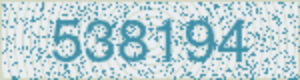
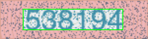
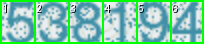

## Описание проекта

**CaptchaSolver** это скрипт для автоматического входа в аккаунт на сайте [majestic.com](https://majestic.com) за счёт автоматического решения графической капчи с цифрами с помощью сверточной нейросети на TensorFlow/Keras (`digit_model.keras`), обученной распознавать отдельные цифры.


Основная идея:

- **Скриншот капчи** берём напрямую через Selenium.
- **Обрезаем изображение** по заранее подобранным отступам, чтобы убрать рамку и артефакты.
- **Режем капчу на 6 частей** (по количеству цифр).
- **Каждую цифру подаём в сверточную нейросеть** (`digit_model.keras`), обученную на датасете вырезанных цифр.
- **Подставляем предсказанный код** в поле капчи и отправляем форму логина.

По результатам теста **из 100 попыток входа 100 были успешными** (капча распозналась корректно, либо сайт принял вход с сообщением о слишком большом количестве активных сессий, что мы считаем успешным решением капчи).


## Как именно мы решаем капчу

### 1. Получение изображения капчи

- Используем Selenium (`webdriver.Chrome`) для открытия страницы логина [https://majestic.com/account/login](https://majestic.com/account/login).
- Находим тег `img[alt='captcha']` и получаем **PNG-скриншот** через `screenshot_as_png`.
- Преобразуем байты в объект `PIL.Image`:
  - приводим к RGB,
  - далее работаем только с этим изображением.

### 2. Обрезка капчи (crop)

Обрезка реализована в функции `crop_image` из `login_with_captcha.py`. Используются константы:

- **CROP_TOP** = 18
- **CROP_BOTTOM** = 18
- **CROP_LEFT** = 46
- **CROP_RIGHT** = 50

Логика:

- Вычисляем допустимую область по ширине и высоте.
- Подрезаем лишние поля сверху/снизу/слева/справа, чтобы:
  - удалить визуальные рамки,
  - сосредоточиться только на области с цифрами.

### 3. Нарезка на отдельные цифры

Функция `split_into_slices`:

- Делит обрезанную картинку по ширине на **6 вертикальных срезов** (`NUM_SLICES = 6`).
- Ширина кадра распределяется равномерно с учётом остатка.
- Результат список из 6 объектов `PIL.Image`, каждый содержит **одну цифру**.

### 4. Подготовка к нейросети и предсказание

Функция `predict_digits`:

- Каждое изображение цифры:
  - приводится к размеру **64×64**,
  - конвертируется в RGB,
  - преобразуется в `numpy`-массив `float32`.
- Собираем все цифры в один **batch** и подаём в модель `digit_model.keras`.
- Модель выдаёт распределение вероятностей по 9 классам (`'1'..'9'`).
- Берём `argmax` по каждому изображению и **прибавляем 1 к индексу**, получая саму цифру.
- Склеиваем цифры в строку — это и есть **распознанный код капчи**.

 

## Примеры обрезки и нарезки капчи (`crop_debug`)

Для наглядности в проекте используется папка `crop_debug`, куда можно сохранять промежуточные этапы обработки:

- **Исходная капча** (как видит браузер).


- **Обрезанная область с цифрами** (после применения `CROP_TOP/BOTTOM/LEFT/RIGHT`).


- **Отдельные цифры** (6 файлов после нарезки).



 

## Структура и ключевые скрипты

- **`digit_classifier.py`**  
  - Обучает сверточную нейросеть для распознавания отдельных цифр (1–9).
  - Использует датасет в папке `digits/`, где есть подпапки `1`, `2`, ..., `9` с изображениями отдельных цифр.
  - Создаёт и сохраняет модель в файл `digit_model.keras`.
  - Также позволяет по одной картинке предсказать цифру через команду `predict`.

- **`login_with_captcha.py`**  
  - Основной скрипт автоматического входа:
    - поднимает Chrome через Selenium,
    - открывает страницу логина,
    - вводит e‑mail и пароль,
    - решает капчу с помощью обученной модели,
    - подставляет ответ и отправляет форму.
  - В цикле выполняет множество попыток входа, логируя результат.
  - При неудачном прохождении капчи сохраняет исходную капчу в папку `failed_captchas/` c именем вида `attempt_XXXX_CODE.png`.

 

## Используемые технологии и библиотеки

- **Python 3.x**  
  Язык реализации всего проекта.

- **TensorFlow / Keras**  
  - Реализация сверточной нейросети.
  - Обучение модели `digit_model.keras` на датасете цифр.
  - Инференс (предсказание цифр по срезам капчи).

- **Selenium WebDriver**  
  - Автоматизация браузера (в примере используется Google Chrome).
  - Открытие страницы логина, поиск полей формы и капчи.
  - Снятие скриншота капчи через `screenshot_as_png`.

- **webdriver_manager**  
  - Автоматически скачивает и настраивает **ChromeDriver** подходящей версии.

- **Pillow (PIL)**  
  - Работа с изображениями капчи.
  - Обрезка (`crop`), изменение размера, конвертация в RGB.

- **NumPy**  
  - Преобразование изображений в массивы,
  - подготовка batch для подачи в нейросеть.

---

## Краткие итоги по качеству решения

- В ходе прогонки скрипта автоматического логина было выполнено **100 последовательных попыток входа в аккаунт**.
- **Все 100/100 попыток были успешными**:
  - либо пользователь попадал в аккаунт,
  - либо сайт отвечал сообщением о слишком большом числе активных сессий, что мы трактуем как успешное прохождение капчи.

## Установка зависимостей

В виртуальном окружении выполните:

```bash
pip install -r requirements.txt
```

## Обучение модели

Из корня проекта (`CaptchaSolver`) запустите:

```bash
python digit_classifier.py train --epochs 10 --batch-size 32
```

Будет обучена и сохранена модель `digit_model.keras`.

## Предсказание цифры по картинке

После обучения:

```bash
python digit_classifier.py predict path\to\cropped_digit.png
```

Скрипт выведет предсказанную цифру от 1 до 9 и уверенность модели.

